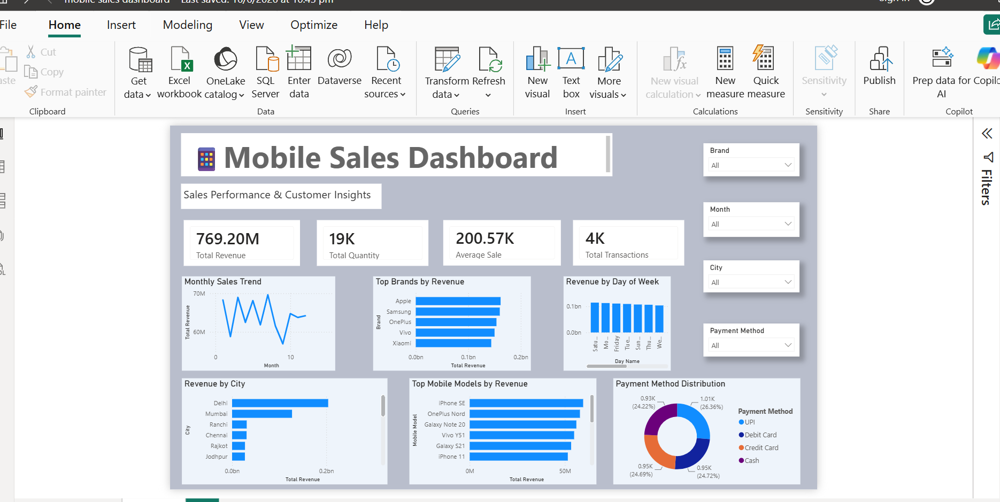

# 📊 Mobile Sales Dashboard (Power BI)

## Overview
This project is an interactive Mobile Sales Dashboard built using Power BI to analyze sales performance and provide business insights.

## Features
- Total Revenue
- Total Quantity Sold
- Average Sale
- Total Transactions
- Monthly Sales Trend
- Top Brands by Revenue
- Revenue by City
- Top Mobile Models by Revenue
- Payment Method Distribution
- Interactive Filters (Brand, Month, City, Payment Method)

## Tools Used
- Power BI
- DAX
- Microsoft Excel

## Dashboard Preview

> *(Upload your dashboard screenshot after creating this README and update the image if desired.)*

## Project Files
- Mobile Sales Dashboard.pbix
- Mobile Sales Dataset.xlsx
- Dashboard Screenshot
